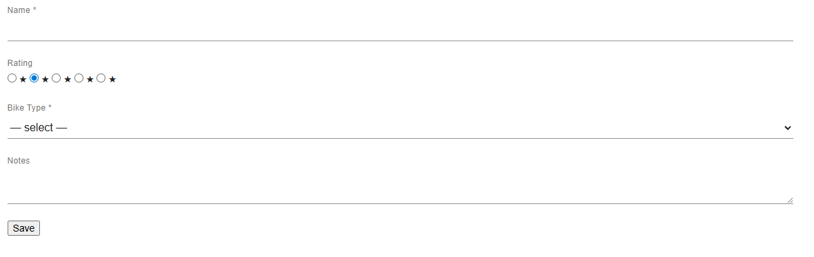

# Heimdal

Heimdal is the UI layer in the norselibs stack, sitting alongside [Ran](../ran) (model introspection) and [Valqueries](../valqueries-sql) (persistence).

The goal is to let backend developers define forms from typed Java code while frontend developers own the component vocabulary as web components. Neither team has to work in the other's domain.

## The problem

Most teams building internal tools or B2B SaaS have 90% backend developers who understand the domain model and can articulate what a page should do, and 10% frontend developers who spend most of their time on individual pages. Heimdal inverts this: the frontend team builds a library of reusable typed web components; the backend team composes pages from that library using the same fluent, method-reference-driven style they already use in Valqueries.

## Architecture

Heimdal uses an MPA-shaped baseline with server-driven partial updates.

- **Server owns**: field visibility, validation rules, form structure
- **Client owns**: current input values (what the user has typed)
- **Stateless server**: each request is independent — no per-user session state

The wire protocol has two HTTP interactions per form URL:

| Method | Purpose |
|--------|---------|
| `GET /bikes/new` | Returns an HTML page with the form definition embedded as JSON |
| `POST /bikes/new` | Validate event — server re-runs validators for a specific field, returns errors |

Submit goes to a separate URL using whatever the framework provides for JSON deserialization. Heimdal is not involved in the submit path.

## Modules

```
heimdal-core              Framework-agnostic. Form builder, list builder, annotation
                          registry, component registry, code generation, validators,
                          wire protocol types. No dependency on any web framework.

heimdal-var               var-http adapter. VarHeimdal (per-request context) and
                          VarHeimdalParameterHandler (DI integration).
                          Depends on heimdal-core via api.

heimdal-material          Material Design styling via MUI CSS. Overrides the page
                          shells to load MUI CSS + a CSS-only reskin (forms.css).
                          No new web components — the default fields.js is unchanged.

heimdal-integration-test  Runnable demo. Full bike CRUD with both explicit and
                          auto forms/lists. Uses heimdal-material for styling.
```

## A component, end to end

This walkthrough shows the complete lifecycle of a custom component: the frontend team writes it, the generator picks it up, the backend team uses it, and it renders in the browser.

### 1 — Frontend: define the component

The frontend developer creates `src/main/resources/static/heimdal/custom-fields.js`. The `static heimdal` block is the only thing the form framework reads:

```javascript
/**
 * hm-rating-field  —  1–5 star rating backed by an integer.
 * default: false means this is an alternative to hm-number-field,
 * not a replacement for it as the canonical integer component.
 */
class HmRatingField extends HTMLElement {
    static heimdal = { type: 'integer', default: false };

    get value() {
        const checked = this.querySelector('input[type=radio]:checked');
        return checked ? checked.value : '';
    }

    setErrors(messages) {
        const el = this.querySelector('.hm-error');
        if (!el) return;
        el.textContent = messages[0] ?? '';
        el.hidden = messages.length === 0;
    }

    connectedCallback() { this._render(); }

    _render() {
        const name    = this.getAttribute('name') ?? '';
        const label   = this.getAttribute('label') ?? '';
        const current = this.getAttribute('value') ?? '';
        const stars   = [1,2,3,4,5].map(n => `
            <label>
                <input type="radio" name="${name}" value="${n}"
                       ${String(n) === current ? 'checked' : ''}>★
            </label>`).join('');
        this.innerHTML = `
            <div class="hm-field">
                <span class="hm-label">${label}</span>
                <div>${stars}</div>
                <span class="hm-error" hidden></span>
            </div>`;
    }
}
customElements.define('hm-rating-field', HmRatingField);
```

**Contract with `hm-form`:** `get value()` returns the current value as a string; `setErrors(messages)` displays or clears inline validation errors.

### 2 — App startup: register the script

Tell the page shell to load your component file alongside the standard `fields.js`:

```java
// In app startup, before the HTTP server starts:
VarHeimdal.registerComponentScript("/heimdal/custom-fields.js");
```

Without this, `hm-form.js` calls `document.createElement("hm-rating-field")` and gets a silent generic element — the custom element is never registered so nothing renders.

### 3 — Generator: produce the typed method

`./gradlew generateFormBuilder` scans all `*.js` files under `static/heimdal/` from every JAR and resource directory on the classpath. It reads `static heimdal = { type: 'integer', default: false }` and adds to `Hm.java`:

```java
// Generated — do not edit
public FieldBuilder<T> ratingField(Function<T, java.lang.Integer> getter) {
    return field(getter).component("hm-rating-field");
}
```

`default: false` means integer fields still default to `hm-number-field`; `ratingField()` is an opt-in alternative that explicitly sets the component override.

### 4 — Backend: use it in a form

```java
vh.form(Bike.class, "/bikes/save",
    f -> f.textField(Bike::getName).required(),
    f -> f.ratingField(Bike::getRating)          // typed — only accepts Function<T, Integer>
           .label("Overall Rating")
           .required(),
    f -> f.field(Bike::getBikeType).required()
)
```

IDE completion shows `ratingField` alongside `textField`, `dateField`, `integerField` etc. Passing a getter that returns the wrong type is a compile error.

### 5 — In the browser



---

## Form builder

Each field is declared in its own lambda. The lambda parameter `f` is `Hm<T>` — a generated typed form builder that exposes a method for each registered component:

```java
vh.form(Bike.class, "/bikes",
    f -> f.textField(Bike::getName).required()
           .validate(Validators.minLength(3))
           .validate(Validators.maxLength(50)),
    f -> f.field(Bike::getBikeType).required(),        // enum → hm-select-field automatically
    f -> f.section("Suspension",                       // labelled section → <fieldset><legend>
        q -> q.eq(Bike::getBikeType, BikeType.MOUNTAIN),
        s -> s.integerField(Bike::getSuspensionTravel)
              .label("Suspension Travel (mm)").required().validateOnBlur()
    ),
    f -> f.textareaField(Bike::getNotes)
           .validate(Validators.maxLength(200))
)
```

Ran intercepts the getter calls to derive property names, types, and labels. The developer only states what can't be inferred:

| Call | Why explicit |
|---|---|
| `.required()` | UI concern, not a domain annotation |
| `.label("...")` | Only when the token-derived label is wrong or needs a unit |
| `.validateOnBlur()` | Fields that need a server round-trip but have no custom validators |
| `.validate(rule)` | Attaches a validation rule; automatically enables blur-time validation |
| `.readonly()` | Field is displayed but not editable |

## Validators

`Validators` provides named rules with sensible default messages:

```java
f -> f.textField(Claim::getEmail).validate(Validators.email())

f -> f.textField(Bike::getName)
       .validate(Validators.minLength(3))
       .validate(Validators.maxLength(50), "Name must be 50 characters or fewer")

f -> f.textField(Claim::getPostalCode)
       .validate(Validators.pattern("\\d{4,6}", "Must be a 4–6 digit postal code"))
```

Available: `minLength(n)`, `maxLength(n)`, `email()`, `pattern(regex, message)`, `numeric()`. Convenience shorthands: `.minLength(n)` and `.maxLength(n)` directly on `FieldBuilder`.

Attaching any validator automatically enables blur-time validation. Custom validators are plain lambdas:

```java
f -> f.textField(Bike::getName)
       .validate(v -> v.contains(" ") ? Optional.empty() : Optional.of("Must include a space"))
```

### Predicate validators

Use the same `q ->` algebra for value comparisons. The message comes first to avoid overload ambiguity:

```java
f -> f.dateField(Claim::getIncidentDate).required()
       .validate("Cannot be in the future",
                 q -> q.lte(Claim::getIncidentDate, LocalDate.now()))
```

Available comparisons (lexicographic — correct for ISO 8601 dates): `lte`, `gte`, `lt`, `gt`.

For cross-field comparisons use `ltField`, `lteField`, `gtField`, `gteField`:

```java
f -> f.dateField(Claim::getTripEndDate)
       .validate("Must be after start date",
                 q -> q.gtField(Claim::getTripEndDate, Claim::getTripStartDate))
```

## Context predicates

Fields whose presence depends on server-side context (user role, request attributes) use `when(boolean, body)`. The boolean is evaluated once at form-build time and never goes to the wire:

```java
f -> f.when(user.getAuthority() == Authority.STANDARD, s ->
        s.decimalField(Claim::getEstimatedAmount))
```

## Actions

Forms can declare multiple named submit buttons, each posting to its own URL. `enabledWhen` is evaluated client-side on every input change:

```java
f -> f.action("Save Draft", "/claims/draft"),
f -> f.action("Submit Claim", "/claims/submit")
       .enabledWhen(q -> q.allRequiredFieldsValid())
       .onError(DuplicateClaimException.class, (e, err) ->
           err.field(Claim::getPolicyNumber, "A claim already exists for this policy"))
```

`allRequiredFieldsValid()` only considers fields in **visible** sections — hidden conditional sections are excluded from the check.

`onError` registers a domain exception handler. When the save throws, Heimdal checks the registered handlers and returns a 422 with field errors if one matches, or rethrows if none do.

### Wiring save handlers with onError

Build a minimal form definition with just the action builders, then pass it to `vh.save()`:

```java
// Build def once — carries the action builders and their onError handlers.
// The proxy instance is still needed for getter → field name resolution in FieldErrors.
private FormDefinition<Claim> actionDef(Claim claim, String submitUrl) {
    var hm = Form.of(Claim.class, claim);
    hm.action("Submit Claim", submitUrl)
      .enabledWhen(q -> q.allRequiredFieldsValid())
      .onError(DuplicateClaimException.class, (e, err) ->
          err.field(Claim::getPolicyNumber, "A claim already exists for this policy"));
    return hm.build();
}

@Controller(path = "/claims/save", httpMethods = HttpMethod.POST)
public Object saveClaim(@RequestBody Claim claim, VarHeimdal vh) throws Exception {
    return vh.save(claim, actionDef(claim, "/claims/save"), this::submitClaim, "/claims");
}

private void submitClaim(Claim claim) throws DuplicateClaimException {
    if (isDuplicate(claim)) throw new DuplicateClaimException(claim.getPolicyNumber());
    claimRepository.save(claim);
}
```

`vh.save()` accepts a `ThrowingConsumer<T>` so the handler can throw checked exceptions directly.

Sections render as `<fieldset>/<legend>` pairs. A section without a label is an anonymous group.

`vh.form()` dispatches on HTTP method: GET returns the HTML page, POST handles a validate event. Edit forms pass the existing entity as initial values:

```java
vh.form(Bike.class, existingBike, "/bikes",
    f -> f.textField(Bike::getName).required(),
    ...
)
```

## Auto-form

When field order and component choices can be fully derived from the model, declare the form in one line. Heimdal walks the DTO's declared fields using Ran's `TypeDescriber` and applies annotation hints:

```java
@ControllerClass
public class BikeFormController {

    @Controller(path = "/bikes/auto")
    public Object autoPage(VarHeimdal vh) throws Exception {
        return vh.autoForm(Bike.class, "/bikes");
    }
}
```

Annotate the DTO to provide hints:

```java
public class Bike {
    @HmRequired
    private String name;

    @HmRequired
    private BikeType bikeType;

    @HmLabel("Suspension Travel (mm)")
    @HmRequired
    @HmValidateOnBlur
    private int suspensionTravel;

    @HmMultiline
    @HmValidateOnBlur
    private String notes;
}
```

Available annotations: `@HmRequired`, `@HmLabel`, `@HmMultiline`, `@HmValidateOnBlur`, `@HmReadonly`, `@HmComponent`, `@HmExclude`.

### Sections from DTO structure

A field whose type is not a registered component is treated as a section — its own fields are rendered as a group. This lets the DTO structure express the form structure without annotations:

```java
public class BikeFormDto {
    @HmRequired String name;
    @HmRequired BikeType bikeType;
    SuspensionSection suspension;   // complex type → always-visible section
    @HmMultiline String notes;
}

public class SuspensionSection {
    @HmLabel("Suspension Travel (mm)") @HmRequired @HmValidateOnBlur
    int suspensionTravel;
    String forkBrand;
}
```

### Auto-form overrides

When the auto-inferred defaults aren't quite right for specific fields, pass an override consumer. Overrides are applied **on top of** annotation-driven defaults — you only state what differs:

```java
vh.autoForm(Bike.class, "/bikes/save", o -> {
    o.field(Bike::getName).label("Bicycle Name").minLength(3).maxLength(50);
    o.field(Bike::getSuspensionTravel).validateOnBlur();
});

// Edit form with the same overrides:
vh.autoForm(Bike.class, existingBike, "/bikes/save", o ->
    o.field(Bike::getName).label("Bicycle Name").minLength(3)
);
```

Available override methods: `label`, `required`, `readonly`, `multiline`, `component`, `validateOnBlur`, `validate(Validator)`, `validate(message, q -> ...)`, `minLength`, `maxLength`.

For DTO-structure sections (nested complex types), add a visibility predicate that otherwise defaults to always-visible:

```java
vh.autoForm(BikeFormDto.class, "/save", o ->
    o.sectionWhen(BikeFormDto::getSuspension,
                  q -> q.eq(BikeFormDto::getBikeType, BikeType.MOUNTAIN))
);
```

### Annotation registry

Third-party annotations (Bean Validation, Spring, etc.) can be mapped to the same actions via `AnnotationRegistry`. Heimdal's own annotations are pre-registered; adapters add theirs at startup:

```java
// In a hypothetical heimdal-spring adapter:
AnnotationRegistry.register(NotNull.class,  (a, f) -> f.required());
AnnotationRegistry.register(NotBlank.class, (a, f) -> f.required());
```

## Component system

### JS is the source of truth

Frontend developers declare component metadata alongside the component implementation:

```javascript
class HmRatingField extends HTMLElement {
    // type: language-agnostic name → Java type mapping (see table below)
    // default: true → register as the canonical component for this Java type
    static heimdal = { type: 'integer' };   // default: false (opt-in variant)

    get value() { /* return current value as string */ }
    setErrors(messages) { /* display or clear inline errors */ }
}
customElements.define('hm-rating-field', HmRatingField);
```

Standard components in `fields.js` use `default: true`:

```javascript
class HmTextField extends HmBaseField {
    static heimdal = { type: 'string', default: true };
    ...
}
customElements.define('hm-text-field', HmTextField);
```

### Type mapping

| Heimdal type | Java type |
|---|---|
| `string` | `String` |
| `integer` | `Integer` |
| `long` | `Long` |
| `decimal` | `BigDecimal` |
| `boolean` | `Boolean` |
| `date` | `LocalDate` |
| `datetime` | `LocalDateTime` |

A component with `types: ['integer', 'long', 'decimal']` generates one typed method per type (`integerField`, `longField`, `decimalField`). A component with `type: 'string', multiline: true` generates `textareaField()` which sets the component override rather than registering as the String default.

### Code generation

`./gradlew generateFormBuilder` scans all `static/heimdal/*.js` files from every JAR and resource directory on the classpath. It generates `Hm.java` — a typed `FormBuilder` subclass — into `build/generated-sources/heimdal/`. This runs before `compileJava` with no circular dependency.

The generated `Hm<T>` includes:
- `ComponentRegistry.register(...)` calls for every `default: true` component
- A typed method per component (`textField`, `integerField`, `ratingField`, ...)
- A `section()` overload that passes `Hm<T>` to the body, so typed methods are available inside sections

Drop a JS file into `src/main/resources/static/heimdal/` to add project-specific components. The generator picks it up automatically.

### Wiring in Gradle

```groovy
def generatedSourcesDir = layout.buildDirectory.dir('generated-sources/heimdal')

def generateFormBuilder = tasks.register('generateFormBuilder', JavaExec) {
    classpath = configurations.runtimeClasspath + sourceSets.main.resources.sourceDirectories
    mainClass = 'io.norselibs.heimdal.FormBuilderSourceGenerator'
    args = [generatedSourcesDir.get().asFile.absolutePath]
    inputs.files(configurations.runtimeClasspath, sourceSets.main.resources.srcDirs)
    outputs.dir(generatedSourcesDir)
}

sourceSets.main.java.srcDir generatedSourcesDir
tasks.named('compileJava') { dependsOn generateFormBuilder }
```

## List pages

Lists use the same varargs-per-item pattern as forms. `l` is a `ListBuilder<T>`:

```java
vh.list(Bike.class, bikes,
    l -> l.column(Bike::getName),
    l -> l.column(Bike::getSuspensionTravel).label("Travel (mm)"),
    l -> l.column(Bike::getBikeType),
    l -> l.action("New",  "/bikes/new"),
    l -> l.rowAction("Edit", bike -> "/bikes/" + bike.getId() + "/edit")
)
```

Column labels derive from the property token. Values are serialized via `ComponentRegistry`. The URL producer in `rowAction` can return a `String` or any object whose `toString()` is a URL (including var-http `Route` objects).

### Auto-list

```java
vh.autoList(Bike.class, bikes,
    l -> l.action("New",  "/bikes/new"),
    l -> l.rowAction("Edit", bike -> "/bikes/" + bike.getId() + "/edit")
)
```

Columns are inferred from the DTO's registered/primitive properties in declaration order. Complex types and `@HmExclude` fields are skipped. Actions and row actions are still declared explicitly via lambdas.

`hm-list.js` ships with `heimdal-core` and renders a plain HTML table. The wire format includes a `pagination: null` stub reserved for future sort/page support.

The recommended `StaticController` pattern uses wildcard path variables so no code change is needed when adding new assets:

```java
@Controller(path = "/heimdal/{file}")
public void heimdal(@PathVariable(name = "file") String file,
                     ResponseStream rs, ResponseHeader rh) throws IOException {
    serve("/static/heimdal/" + sanitize(file), contentType(file), rs, rh);
}
```

## Inline editable collections

A field backed by a `List<DTO>` renders as an editable table — add rows, remove rows, edit cells. No server round-trips for add/remove; the whole collection submits as part of the form.

```java
f -> f.collectionField(Claim::getWitnesses, Witness.class, c -> {
    c.column(Witness::getName).label("Full Name");
    c.column(Witness::getPhone).label("Phone");
})
```

Column names, labels, and input types are derived from the item class via Ran method references. Override the label with `.label("...")` and mark a column required with `.required()`.

**Column type mapping:** `String` → text input, `Integer`/`Long` → number, `BigDecimal` → decimal number, `Boolean` → text (future: checkbox), `LocalDate` → date picker.

**Wire protocol:** the component's `value` is a JavaScript array, so `JSON.stringify` in `hm-form` nests it correctly. Jackson on the server sees `{"witnesses": [{"name":"...", "phone":"..."}]}` and deserializes directly to `List<Witness>` — no custom deserializer needed.

**Validation:** the whole collection is validated server-side on submit. Per-row blur validation is not currently supported.

The `hm-collection-field` component is built into `heimdal-core/fields.js`. No component registration or code generation step needed — `collectionField()` is available on `Hm<T>` directly.

## Server-driven visibility updates

For predicates that can't be evaluated client-side — database lookups, permission checks, or complex cross-field comparisons like `lteField`/`gteField` — mark the field with `.triggersUpdate()`. When that field changes, the client posts the current form values to the server. The server re-evaluates all section predicates (including those the client can't handle) and returns an authoritative visibility map. The client shows or hides sections accordingly.

```java
// claimType controls which of four conditional sections is visible.
// triggersUpdate ensures the server evaluates the predicates,
// useful when visibility depends on server-side state.
f -> f.field(Claim::getClaimType).required().triggersUpdate()
```

### Project default and per-field override

Set the default trigger once at startup:

```java
// In app startup — fast backend: fire on change (default)
HeimdallConfig.setDefaultUpdateTrigger(UpdateTrigger.CHANGE);

// Slow backend: wait until the user leaves the field
HeimdallConfig.setDefaultUpdateTrigger(UpdateTrigger.BLUR);
```

Override per field:

```java
f -> f.field(Claim::getCountry).required().triggersUpdate()                    // uses default
f -> f.field(Claim::getExpensiveField).triggersUpdate(UpdateTrigger.BLUR)      // explicit override
```

### Wire protocol

```
Client → POST /claim/new  { type: "update", field: "claimType", seq: 2, values: {...} }
Server → { seq: 2, sections: { "s1": true, "s2": false, "s3": false } }
```

The `seq` counter ensures stale responses (superseded by newer events) are discarded.

## Conditional sections

Section visibility uses the same predicate algebra as Valqueries queries. Simple predicates (`eq`, `neq`, `in`) are serialized to JSON and evaluated client-side — no round trip.

```java
f -> f.section(
    q -> q.eq(Bike::getBikeType, BikeType.MOUNTAIN),
    s -> s.integerField(Bike::getSuspensionTravel).required()
)

// Multiple values
f -> f.section(
    q -> q.in(Bike::getStatus, Status.ACTIVE, Status.PENDING),
    s -> s.dateField(Claim::getExpiryDate).required()
)
```

## Layout components

Non-field elements (info panels, dividers, help text) use `layout()`:

```java
f -> f.layout("hm-info-panel", props -> props
    .put("title", "About bike types")
    .put("content", "Mountain bikes have front suspension.")
)
```

Layout items appear in the form JSON with a `component` key but no `name` and are excluded from field tracking and validation.

## Web components contract

Field components must implement:

```javascript
get value()                        // returns current value as a string
setErrors(messages: string[])      // display or clear inline errors
```

`hm-form` creates the component tree from the embedded JSON, wires validate events, evaluates visibility predicates, and handles submit. Load `fields.js` before `hm-form.js`.

## File upload

Use `byte[]` in the model — no wrapper type, Jackson decodes base64 to `byte[]` automatically on `@RequestBody` deserialization:

```java
public class Bike {
    private byte[] photo;
    // getter + setter
}
```

`fileUploadField()` is generated automatically when `hm-file-upload` is loaded. The component reads the selected file, encodes it as base64, and returns it as the field value:

```java
f -> f.fileUploadField(Bike::getPhoto)
       .label("Photo")
       .accept("image/*")    // restricts the file picker
       .maxSizeMb(5)         // client-side size guard
```

The controller receives the model with the bytes already in place — store them wherever suits the application (filesystem, S3, database blob, etc.).

For multiple files, use `List<byte[]>` in the model and a separate `hm-multi-upload` component (future work). For large files, prefer direct upload to object storage with a pre-signed URL rather than routing bytes through the form submission.

## Detail pages

A read-only view of a single entity. All fields are auto-generated as readonly. Use `link()` lambdas to add GET navigation links:

```java
@Controller(path = "/bikes/{id}/detail")
public Object detail(@PathVariable(name = "id") int id, VarHeimdal vh) throws Exception {
    return vh.detail(Bike.class, findById(id),
        f -> f.link("Edit", "/bikes/" + id + "/edit"),
        f -> f.link("Back", "/bikes")
    );
}
```

`link()` produces an `<a href="url">` element styled as an outlined button. `action()` produces a `<button>` that POSTs — both can appear together on the same page.

Field labels, order, and sections are derived from the model and its annotations, exactly as in `autoForm`. Annotations like `@HmReadonly` on the model are respected, though they're redundant since `detail()` forces all fields readonly.

## Navigation menu

Configure a global nav bar once at app startup. It appears on every form and list page.

```java
// In app startup:
VarHeimdal.setAppName("<strong>MyApp</strong>");          // HTML — include a logo if you want
VarHeimdal.addMenuItem("Bikes",  "/bikes");               // no icon
VarHeimdal.addMenuItem("Claims", "/claims", "📋");        // emoji icon
VarHeimdal.addMenuItem("Reports", "/reports",
    "");           // any inline HTML as icon
```

`iconHtml` is arbitrary HTML injected before the label — emoji, ``, Material Icons `<i>`, or any inline element. Omit it for text-only items.

The active item is detected by prefix-matching the current request URI with a `/` boundary guard: `/bikes/1/edit` highlights the Bikes item, but a hypothetical `/bikes-management` route does not.

The default adapter renders a dark `#333` nav bar. `MaterialVarHeimdal` overrides `renderMenu()` to produce an MUI AppBar. Pages with no menu items registered render no nav element.

## var-http integration

`heimdal-var` provides `VarHeimdal` (per-request context) and `VarHeimdalParameterHandler` (DI wiring). Add to your project:

```groovy
implementation 'io.norselibs:heimdal-var:0.1-SNAPSHOT'
```

**One-time setup** in app startup:

```java
config.addParameterHandler(VarHeimdalParameterHandler.class);
```

**Controller**:

```java
@ControllerClass
public class BikeFormController {

    @Controller(path = "/bikes/new")
    public Object page(VarHeimdal vh) throws Exception {
        return vh.form(Bike.class, "/bikes",
            f -> f.textField(Bike::getName).required(),
            f -> f.field(Bike::getBikeType).required(),
            f -> f.section(
                q -> q.eq(Bike::getBikeType, BikeType.MOUNTAIN),
                s -> s.integerField(Bike::getSuspensionTravel)
                      .label("Suspension Travel (mm)").required().validateOnBlur()
            ),
            f -> f.textareaField(Bike::getNotes).validateOnBlur()
        );
    }

    @Controller(path = "/bikes", httpMethods = HttpMethod.POST)
    public Map<String, Object> createBike(@RequestBody Bike bike) {
        bikeService.save(bike);
        return Map.of("redirect", "/bikes/new");
    }
}
```

## Running the integration test

```bash
./gradlew :heimdal-integration-test:run
```

Open `http://localhost:8080/bikes/new` for the explicit form or `http://localhost:8080/bikes/auto` for the auto-form demo.

## Further reading

- `docs/spec.md` — full architecture and design rationale
- `docs/decisions/2026-05-10_wire-protocol-v0.md` — wire protocol specification with annotated JSON examples
